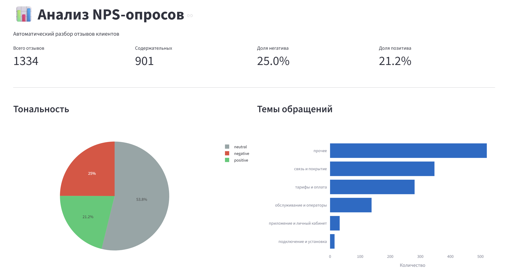
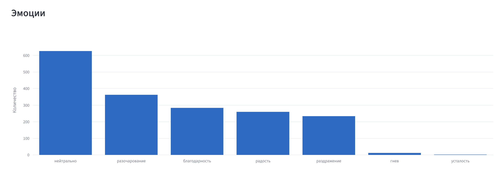
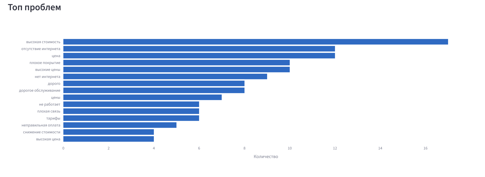
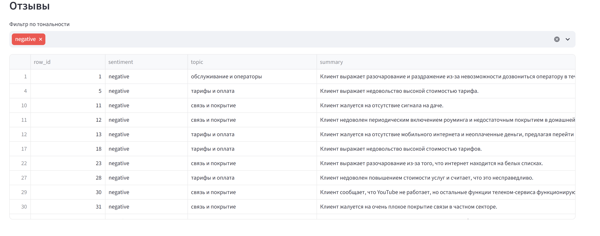
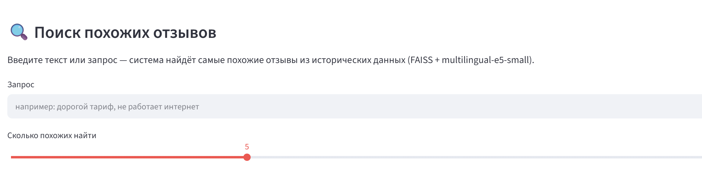
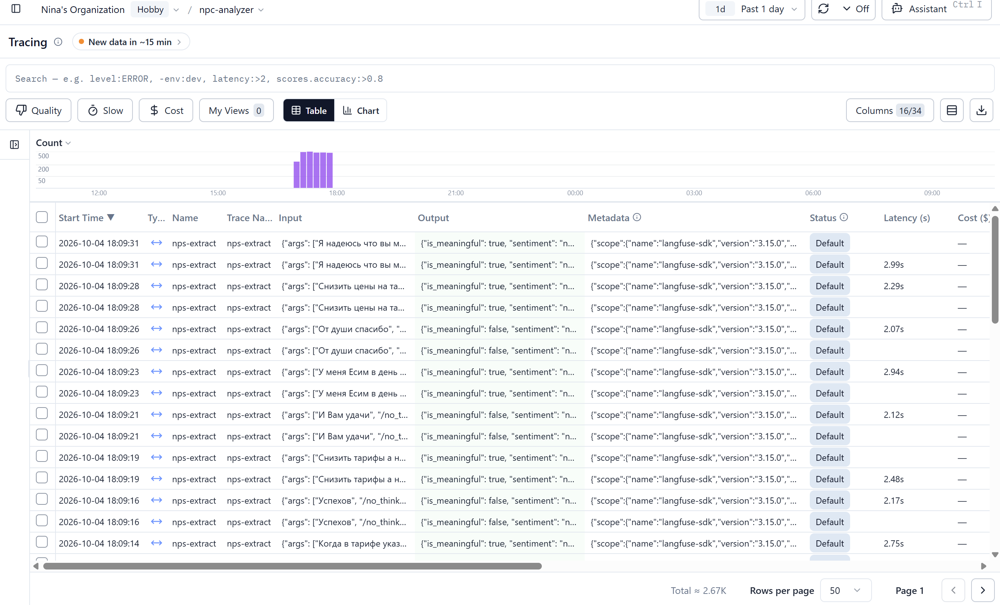

# NPS Analyzer. Автоматизация разбора NPS-опросов клиентов

**Автор:** Нина Шульга
**Дата:** сентябрь-октябрь 2026
**Стек:** Python, Ollama (Qwen 3 8B), Hugging Face, FAISS, Streamlit, Langfuse, Docker

---

## 1. Введение

### Задача
NPS-опросы клиентов компании приходят в виде xlsx-выгрузок, где текстовые комментарии размазаны по нескольким столбцам. Ручной разбор 1000+ анкет занимает дни и не даёт системной картины.

### Цель проекта
Разработать автоматизированный пайплайн анализа текстовых NPS-опросов с помощью локальной LLM, формирующий дашборд с оценкой каждой анкеты и агрегированной аналитикой. Обеспечить LLM Observability через Langfuse.

### Что на входе / выходе
- **Вход:** xlsx-файл с NPS-опросом (1347 текстовых анкет).
- **Выход:** дашборд с оценкой каждой анкеты + агрегированные метрики.

---

## 2. Данные

- **Объём:** 1347 анкет, все с текстовыми комментариями.
- **Структура:** столбцы `create_date`, `subs_id`, `nps_category`, `mark_2`…`mark_7`, `mark_Summ`.
- **Особенности:**
  - Ответы размазаны по 6 столбцам `mark_2`…`mark_7`.
  - Часть значений содержит мусор: склейки, случайные символы.
  - Дубликаты — реальные повторы («Спасибо», «Ок»).

---

## 3. Разведочный анализ данных

### 3.1. Объём и структура
- 1347 анкет, все с текстом.
- Уникальных текстов: 1239, дублей: 108 (8%).
- Средняя длина текста: ~50 символов.

### 3.2. Особенности
- Короткие тексты (<10 символов) — вежливые фразы без сути.
- 32% отзывов помечены LLM как `is_meaningful=false` (короткие вежливые фразы).
- Все данные пригодны для LLM-анализа.

### 3.3. Вывод
Фокус — на извлечении тональности, эмоций, сущностей и тем из текстовых комментариев.

---

## 4. Метод

### 4.1. Пайплайн

xlsx → preprocess → LLM (Qwen 3) → агрегация → дашборд
↓
Langfuse (трейсы)
↓
FAISS (RAG)

### 4.2. Препроцессор (preprocess.py)
- Читает столбцы `mark_2`…`mark_7`.
- Собирает непустые значения в единый текст.
- Чистит от лишних пробелов и двойных точек.
- Сохраняет в `nps_parsed.parquet` (1347 строк).

### 4.3. LLM-анализ
- **Модель:** Qwen 3 (8B) через Ollama — локальный GPU-инференс.
- **Промпт:** строгая JSON-схема, фиксированные списки эмоций и тем, флаг `think=False`.
- **Выходная схема:** `is_meaningful`, `sentiment`, `sentiment_confidence`, `emotions`, `entities`, `topic`, `summary`.

### 4.4. Обработка ошибок
Первый прогон дал 51% ошибок из-за обрезки JSON. Решено:
- `num_predict` увеличен до 2000.
- Парсер восстанавливает обрезанный JSON.
- 3 повторные попытки на каждый текст.
- Checkpoint каждые 50 текстов.

**Итог:** 100% успешных обработок.

### 4.5. Langfuse — observability
Все LLM-запросы трейсятся в Langfuse: latency, токены, input/output. Это позволяет мониторить качество в реальном времени и выявлять проблемные запросы.

### 4.6. RAG
- Эмбеддинги: `intfloat/multilingual-e5-small` (384 размерности).
- Индекс: FAISS (1364 вектора).
- Функция поиска: `rag_search.py`.

---

## 5. Результаты

### 5.1. Тональность (1347 отзывов)
| Класс | Кол-во | Доля |
|---|---|---|
| neutral | 758 | **55.2%** |
| negative | 310 | 22.6% |
| positive | 305 | 22.2% |

### 5.2. Темы
| Тема | Кол-во |
|---|---|
| прочее | 515 |
| связь и покрытие | 364 |
| тарифы и оплата | 288 |
| обслуживание и операторы | 146 |
| приложение и личный кабинет | 42 |
| подключение и установка | 18 |

### 5.3. Эмоции (топ-6)
| Эмоция | Кол-во |
|---|---|
| нейтрально | ~700 |
| разочарование | ~350 |
| благодарность | ~300 |
| радость | ~290 |
| раздражение | ~230 |
| гнев | ~12 |

### 5.4. Топ проблем (NER)
- высокая стоимость
- отсутствие интернета
- высокая цена
- плохое покрытие
- плохая связь

---

## 6. Дашборд

Интерактивный дашборд на Streamlit включает:
- 4 ключевые метрики.
- Pie chart тональности.
- Bar chart топ-тем, эмоций, проблем.
- Таблицу отзывов с фильтрами.
- RAG-поиск похожих отзывов.

### Скриншоты

### Observability

---

## 8. Ограничения и направления развития

### Ограничения
1. **Class imbalance в разметке** — негативных больше, чем позитивных.
2. **Скорость LLM** — ~3 сек/текст, полный прогон ~1 час.

### Направления развития
1. LoRA fine-tuning для быстрой классификации.
2. FastAPI-эндпоинт для интеграции.
3. RAGAS для оценки RAG-качества.

---

## 9. Выводы

Построен полностью автоматизированный пайплайн анализа NPS-опросов:

- **1347 анкет** обработаны, **1334 отзыва** проанализированы LLM.
- **100% успешных обработок** после оптимизации.
- **RAG-поиск** через FAISS.
- **Langfuse** — observability, 1334 трейса.
- **Docker** — воспроизводимое развёртывание.

### Ключевые инсайты
- 53.8% нейтральных, 25.0% негативных, 21.2% позитивных.
- Топ-темы: связь и покрытие, тарифы, обслуживание.
- Топ-эмоции: нейтрально, разочарование, благодарность.

---

## Приложение: стек

| Компонент | Технология |
|---|---|
| LLM | Qwen 3 (8B) через Ollama |
| Embeddings | intfloat/multilingual-e5-small |
| Векторный поиск | FAISS |
| Дашборд | Streamlit + Plotly |
| Observability | Langfuse Cloud |
| Данные | pandas, openpyxl, PyArrow |
| Метрики | scikit-learn |
| Развёртывание | Docker + docker-compose |